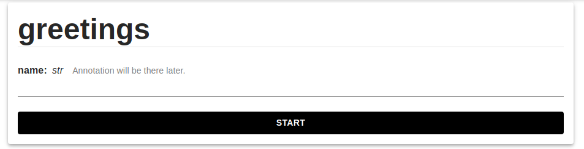

Ywpi
----

Платформа позволяет интерактивно подключать пользовательские алгоритмы для обработки данных.
Platform is a data lake extented by methods (or tools). In other words system for controlling large language model context (tools, resources, indexes). The platfrom will support Model Contrzt Protocol in future releases.

# Quick start

Для подключения собственного метода достаточно установить последнюю версию пакета:

```bash
pip install https://github.com/fruit-freedom/ywpi.git
```

И запустить следующий скрипт:


```python
import ywpi

@ywpi.method
def greetings(name: str):
    print(f'Greet for {name}')
    return {
        'text': f'{name}'
    }

ywpi.serve('MyIdentifier')
```

Далее на странице методов можно наблюдать сформированную форму для вызова метода:



# LLM Agent example
```python
import ywpi

@ywpi.method
def greeting_chat(message: ywpi.Message, thread_id: ywpi.Context[str]):
    # Some complex logic
    return ywpi.Message(
        content=f'Hello, {message}'
    )
```

Run using ywpi cli:
```bash
ywpi run --reload agent.py
```

# Documentation

[Описание проблематики и решения](long_description.md)
